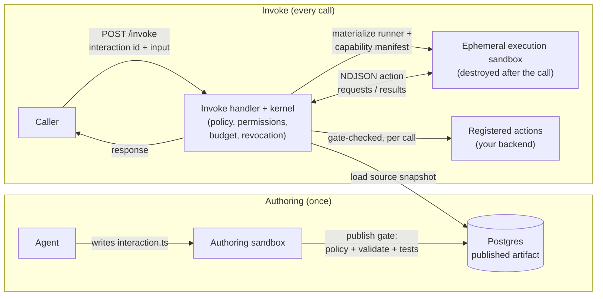

# TideGate

**Agents write the code. TideGate runs it.**

TideGate is an execution kernel for AI-written software. Code written by an
agent never touches the world directly: every action is proposed as a typed
call, the kernel checks policy, permissions, live budget and revocation, then
executes it in a sandbox — and logs every step.

The result is reusable runtime logic: an interaction built once by an agent
becomes a typed, auditable endpoint that your team or your product calls from
code, with no agent in the loop.

## How it works



Two properties do the heavy lifting:

- **The sandbox proposes, the kernel disposes.** Generated code never executes
  an action itself — every `ctx.capabilities.*` call travels over the NDJSON
  protocol to the trusted kernel, which checks the allowlist, permissions,
  live budget and revocation before executing the real action and returning
  the result.
- **The sandbox is disposable, the artifact is not.** The published interaction
  lives in the database as an immutable source snapshot. Each invoke
  re-materializes it into a fresh execution sandbox that is destroyed when the
  call completes.

## Packages

| Package | What it is | License | npm |
|---------|------------|---------|-----|
| [`@tidegate/contracts`](./packages/tidegate-contracts) | Zod contracts for auth context, action catalogs, invoke routes, published artifacts, and execution tracing | Apache-2.0 | [npm](https://www.npmjs.com/package/@tidegate/contracts) |
| [`@tidegate/sdk`](./packages/tidegate-sdk) | Server SDK: action bridge (`defineTidegateActions`, `createTidegateActionHandler`), public interaction invoke client | Apache-2.0 | [npm](https://www.npmjs.com/package/@tidegate/sdk) |
| [`@tidegate/runtime`](./packages/tidegate-runtime) | The kernel: remote action bridge, typed capability codegen, sandbox execution, publication gates | FSL-1.1-ALv2 | — |
| [`@tidegate/auth-server`](./packages/tidegate-auth-server) | Server-side auth: API keys, WorkOS M2M token verification, public API auth context | FSL-1.1-ALv2 | — |

## Quickstart: expose your backend to TideGate

Your backend registers capabilities through the **action bridge**: a manifest
endpoint (`tidegate.actionCatalog.v1`) plus one protected invoke endpoint.
TideGate can call only registered actions that are also allowlisted by the
invoking interaction, with input validation, declared-output validation, and
server-derived auth.

```bash
npm install @tidegate/sdk @tidegate/contracts zod
```

```ts
import { z } from "zod";
import {
  createTidegateActionCatalogManifest,
  createTidegateActionHandler,
  defineTidegateActions,
  tidegateAction,
} from "@tidegate/sdk/server";

const actions = defineTidegateActions({
  booking: {
    cancel: tidegateAction({
      input: z.object({ appointmentId: z.string().min(1) }),
      effects: "write",
      requiredPermissions: ["booking:write"],
      tenantScope: { fromAuth: "tenantId" },

      async execute(input, ctx) {
        return cancelAppointment(input.appointmentId, ctx.auth.tenantId!);
      },
    }),
  },
});

// POST /api/tidegate/actions — protected by TIDEGATE_ACTION_BRIDGE_SECRET
export const POST = createTidegateActionHandler(actions);

// GET /api/tidegate/action-catalog
export const manifest = createTidegateActionCatalogManifest(actions, {
  catalogId: "acme-books",
  version: "2026-07-22T00:00:00.000Z",
});
```

See each package README for the full API surface.

## Development

The repo is a [Bun](https://bun.com) workspace.

```bash
bun install
bun run check-types   # tsc --noEmit in every package
bun test              # all package test suites
```

`@tidegate/contracts` and `@tidegate/sdk` are published to npm from a
generated `dist-pkg/` (`bun run build:pack` inside the package).

## Licensing

TideGate is open core:

- **`@tidegate/contracts`** and **`@tidegate/sdk`** — [Apache-2.0](./packages/tidegate-contracts/LICENSE).
  The integration surface is permissively licensed so any backend can adopt it
  without restrictions.
- **`@tidegate/runtime`** and **`@tidegate/auth-server`** —
  [FSL-1.1-ALv2](./packages/tidegate-runtime/LICENSE) (Functional Source
  License): source-available, free for any non-competing use, and each release
  automatically becomes Apache-2.0 two years after publication.

The hosted platform (console, interaction generation pipeline) is proprietary
and not part of this repository. See [LICENSE.md](./LICENSE.md).

## Contributing & security

- [CONTRIBUTING.md](./CONTRIBUTING.md) — how changes land (this repo mirrors an
  internal monorepo; PRs are reviewed and imported).
- [SECURITY.md](./SECURITY.md) — how to report vulnerabilities privately.
